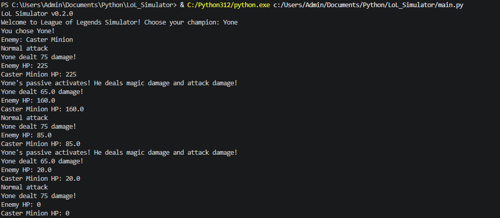

# LoL Simulator

A Python-based combat simulator inspired by League of Legends champions.


*A basic combat loop showcasing Yone's half physical, half magic damage passive that occurs every other auto attack.*

---

## Current Version
v0.2.0 

---

## Features
- Champion selection of two champions
- Basic combat loop
- Jhin’s 4th shot bonus damage mechanic
- Yone passive
- HP clamping (no negative health)

---

## How to Run

1. Clone the repository
2. Open the project folder
3. Run: 

```bash
python main.py 
```

---

## Roadmap

- More champions
- Add unique enemy types specific to champion lore

---

## Notes

This project is part of my learning process with Python and system design.
The project will continue to evolve with new features, improvements, and expanded gameplay systems.
